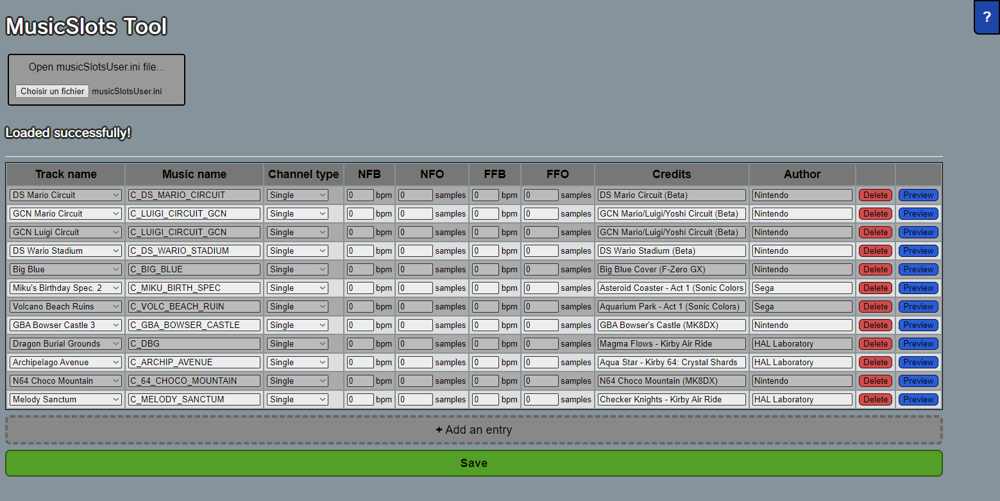
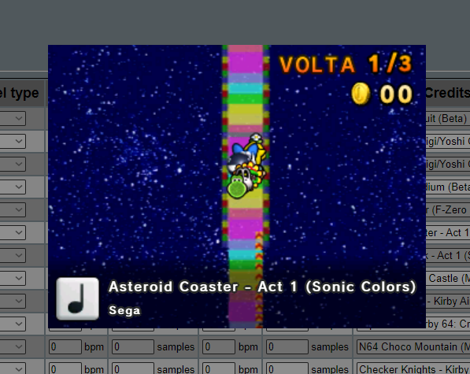

# MusicSlots Tool

An in-browser editor for CTGP-7's `musicSlotsUser.ini`.

Open it here : https://meijirestored.github.io/musicslotstool

## Features

- Selects the track based on itss real name : no need to know the internal filename.
- Validates inputs : Makes sure you do not send an invalid file to your console.
- Credits preview : See if your music credits are not too long and stay on screen.

## How to use

Click the info (?) button on the top right for more information.
